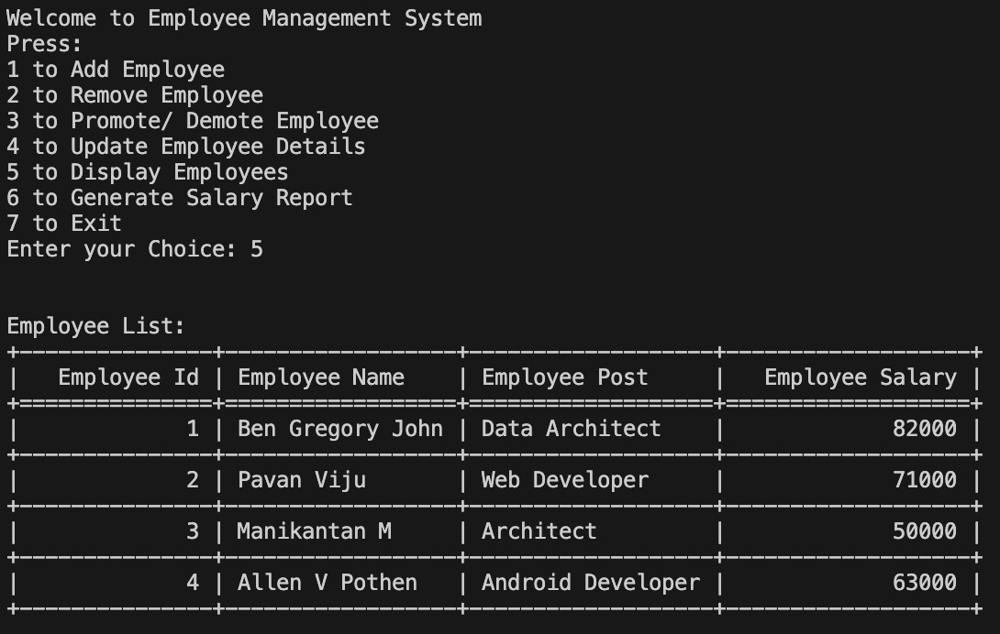

# Employee Management System

## Overview

The **Employee Management System** is a Python-based application that allows users to manage employee records in a MySQL database. This system supports functionalities such as adding, removing, promoting/demoting employees, updating employee details, displaying employee information, and generating a salary report.

## Features

- **Add Employee**: Insert new employee records into the database.
- **Remove Employee**: Delete employee records from the database.
- **Promote/Demote Employee**: Increase or decrease the salary of an employee.
- **Update Employee**: Modify employee details such as name, position, and salary.
- **Display Employees**: View a list of all employees with their details.
- **Generate Salary Report**: Display employee names along with their salaries.

## Requirements

1. **Python**: Ensure Python is installed on your system. This project is compatible with Python 3.x.

2. **MySQL**: You need a MySQL server running on your local machine or a remote server.

3. **MySQL Connector**: Install the MySQL Connector Python package. You can do this using pip:
   ```bash
   pip install mysql-connector-python

## Usage

1. Clone this repository to your local machine

2. Make sure you create a database in MySQL using the code available in [EMPLOYEE_DATABASE](emp.sql)

3. Run main.py file in your terminal

## Sample



## Contributing

If you'd like to contribute to this project, please fork the repository, make your changes, and submit a pull request.

